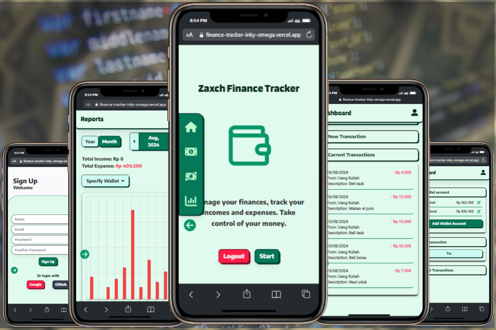
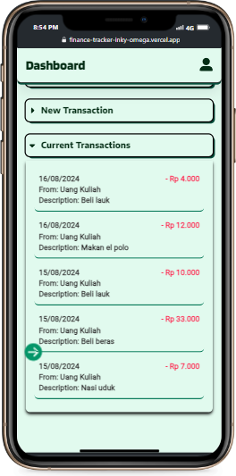
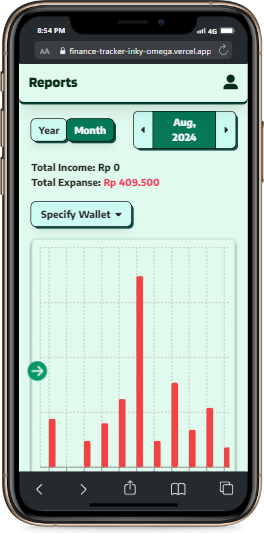
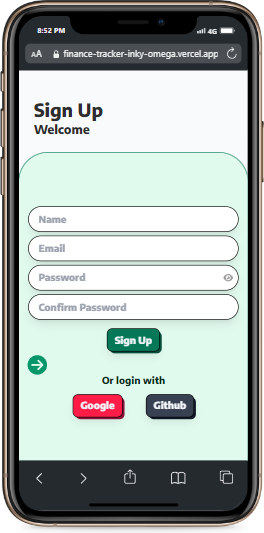

# Personal Finance Tracker

This is an web application that helps users record their income and expenses, as well as create and manage budgets. With interactive visualizations, this app makes it easy for users to track their financial situation efficiently.

### Key Features
- Authentication: Users can register and log in to access their financial data.
- Custom Wallets: Users can create a wallet with multiples currencies
- Transaction Recording: Users can log their income and expenses.
- Financial Analysis: Provides charts and visualizations for income and expense analysis.
- Data Import/Export: Ability to import and export data in CSV format

### Upcoming Features
- Bill Reminders
- Detailed Wallet
- Data Import Features
- Optimized the desktop layout

## Tech Stack
- FrontEnd: Next.js, Tailwind CSS, Framer Motion, React Hot Toast, React Hook Form, Zod
- BackEnd: Firebase Firestore, Firebase Auth
- Charts: Recharts
- Deployment: Vercel
  
## Screenshots

  
  
  

  
  

## Contributing
Contributions are welcome! If you would like to add features or fix bugs, feel free to fork this repository, create a new branch, and submit a pull request.

## License
This project is licensed under the GPL-3.0 [LICENSE](LICENSE). See the LICENSE file for more information
